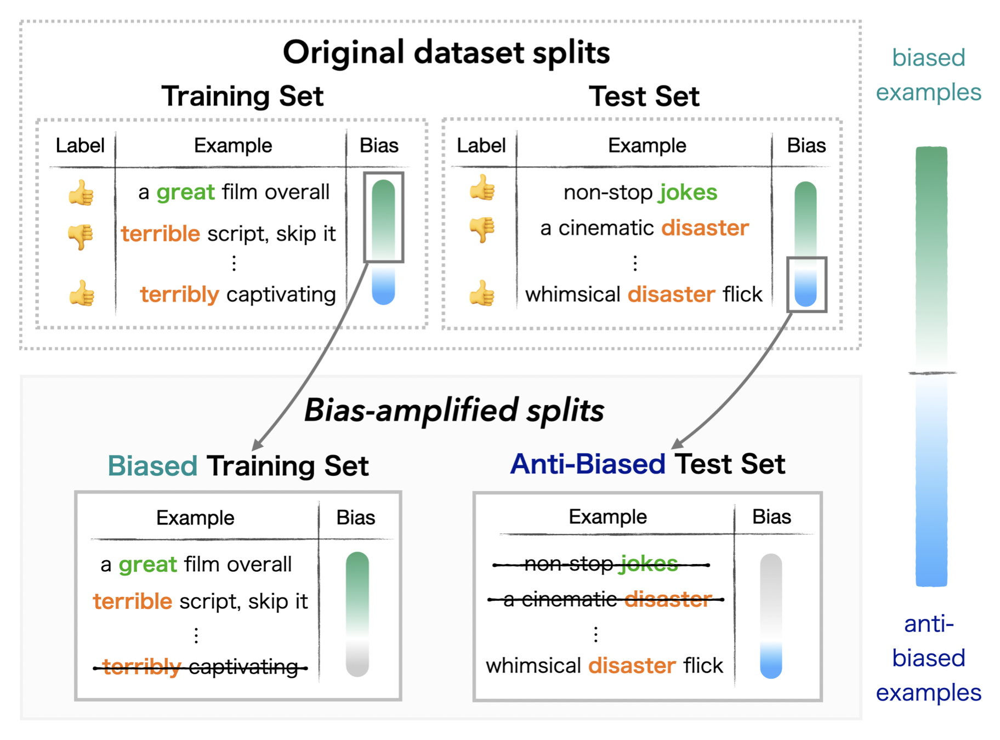

# Fighting Bias with Bias: Promoting Model Robustness by Amplifying Dataset Biases
[**Paper**](https://arxiv.org/pdf/2305.18917.pdf) | [**Bias-amplified Splits on 🤗 Hugging Face Hub**](https://huggingface.co/bias-amplified-splits)

This repository contains the code and data for [Fighting Bias with Bias: Promoting Model Robustness by Amplifying Dataset Biases](https://arxiv.org/abs/2305.18917).

Bias-amplified splits are a new evaluation framework to assess model robustness by amplifying dataset biases in the training data and challenging models to generalize beyond them.
This framework is defined by a bias-amplified training set and a hard, anti-biased test set, which are automatically extracted from existing datasets using model-based methods.



Such splits can be created for any dataset automatically, complementing the dataset's main training and test splits with challenging evaluation settings to promote more robust methods.

## Data
The bias-amplified splits created in the paper (for MultiNLI, Adversarial NLI, WANLI and QQP) are available [here](https://huggingface.co/bias-amplified-splits).


Code for creating bias-amplified splits for other datasets coming soon ⏰.
In the meantime, please feel free to contact Yuval Reif at yuval.reif@mail.huji.ac.il.

## 📘Citation
Please cite the following if you our work useful in your research.
```
@article{reif2023fighting,
  title={Fighting Bias with Bias: Promoting Model Robustness by Amplifying Dataset Biases},
  author={Reif, Yuval and Schwartz, Roy},
  journal={arXiv preprint arXiv:2305.18917},
  year={2023}
}
```

## Contact Us
For questions and usage issues, please contact `yuval.reif@mail.huji.ac.il`.
